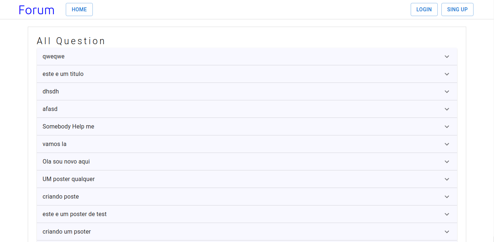
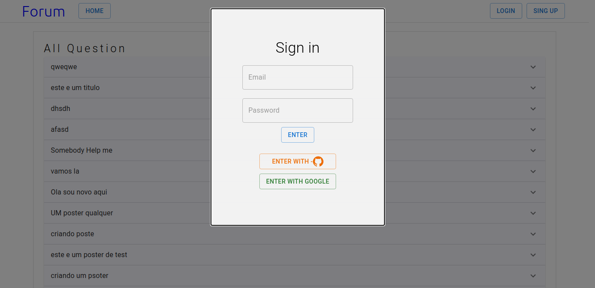
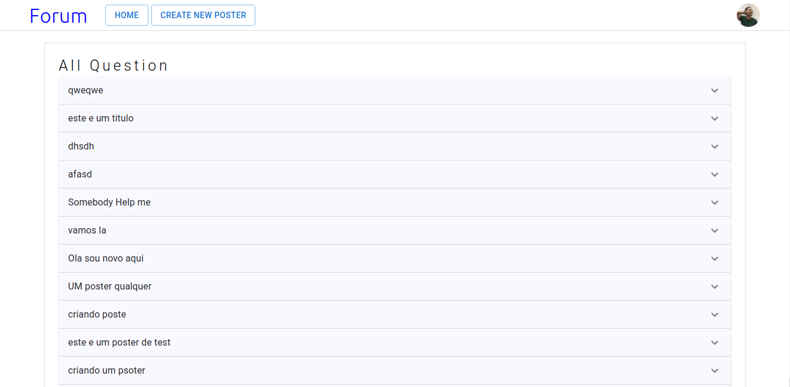

### Criação de um mini projeto (Forum)

#### Tecnologias usadas:

<ul>
  <li><a href='https://www.prisma.io/'>Prisma</a></li>
  <li><a href='https://mui.com/pt/'>Material-Ui</a></li>
  <li><a href='https://www.npmjs.com/package/nookies'>Nookies</a></li>
  <li><a href='https://nextjs.org/'>Next.js</a></li>
  <li><a href='https://www.npmjs.com/package/axios'>axios</a></li>
  <li><a href='https://firebase.google.com/?hl=pt'>Firebase</a></li>
  <li><a href='https://styled-components.com/'>Styled-Components</a></li>
</ul>

### Imagens do projeto:

